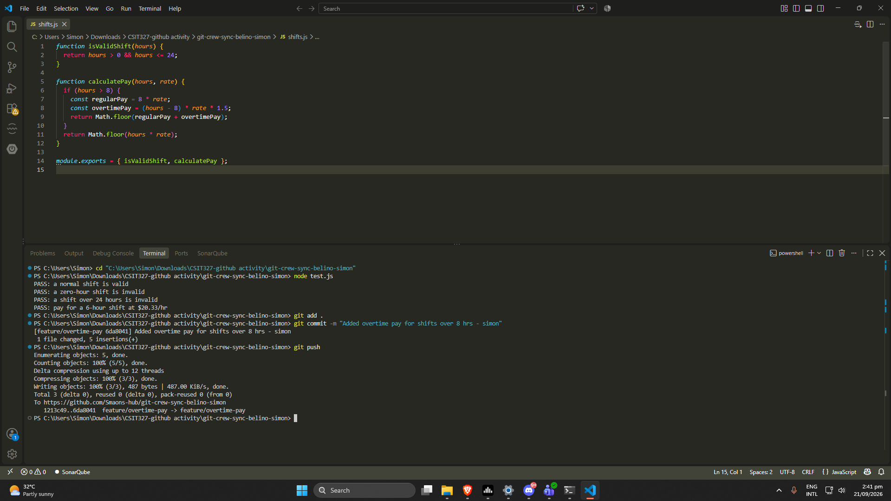
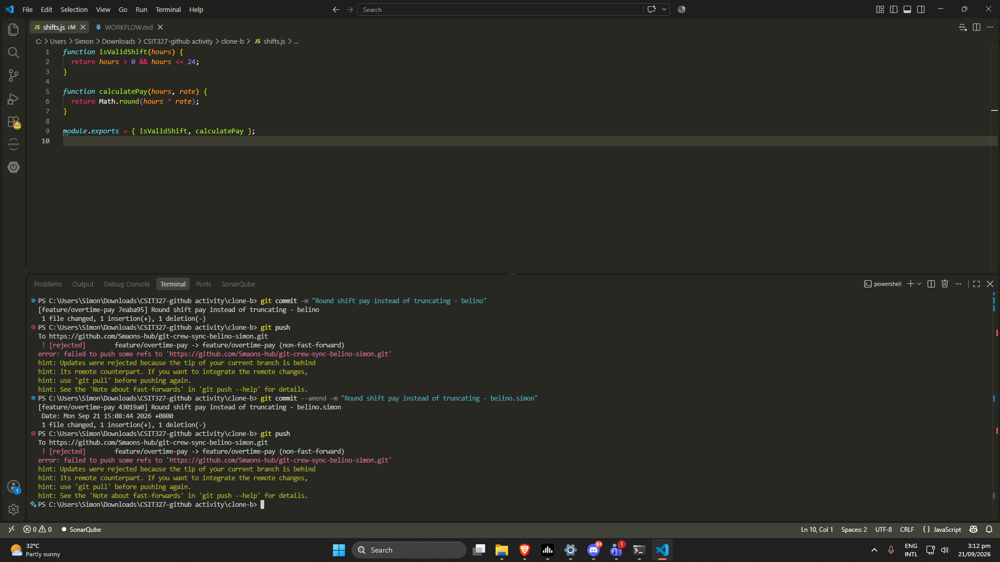
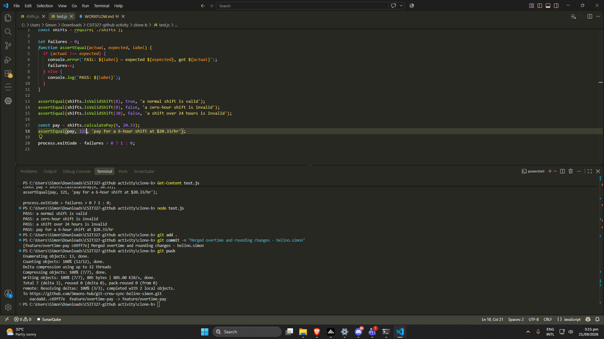
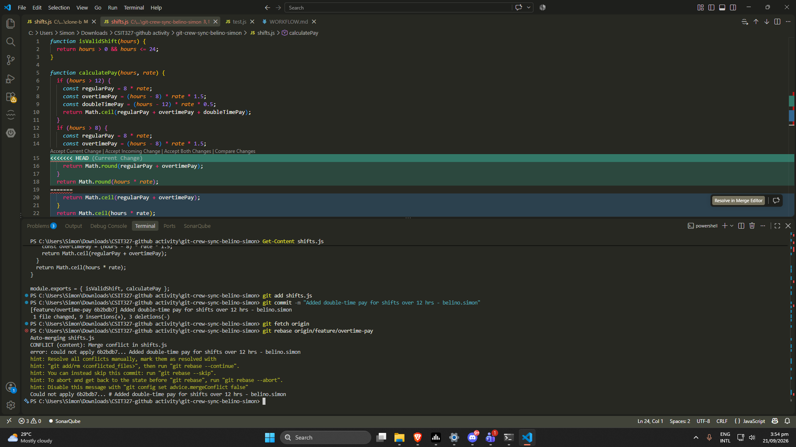
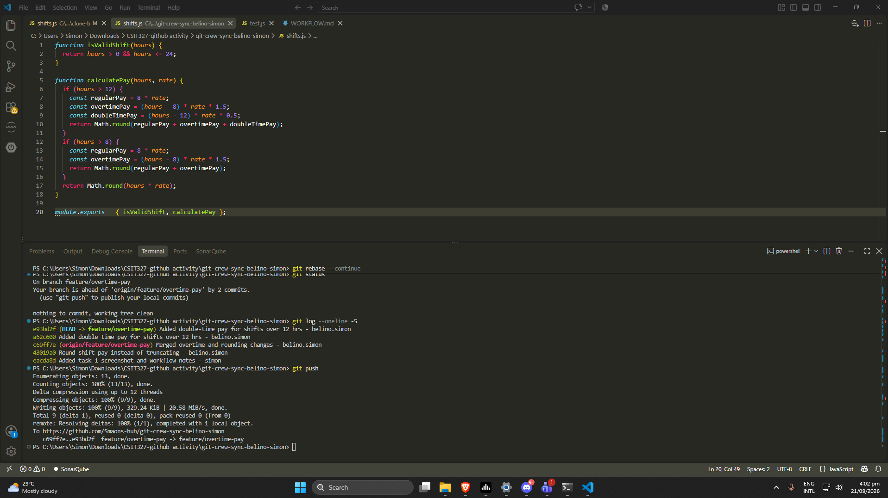
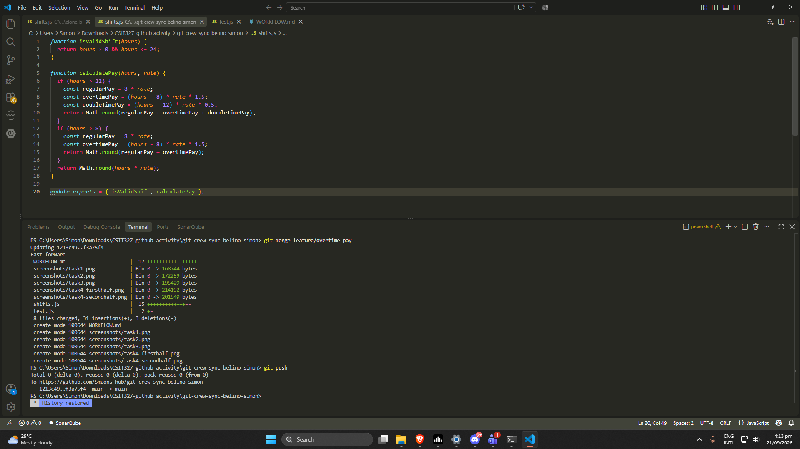
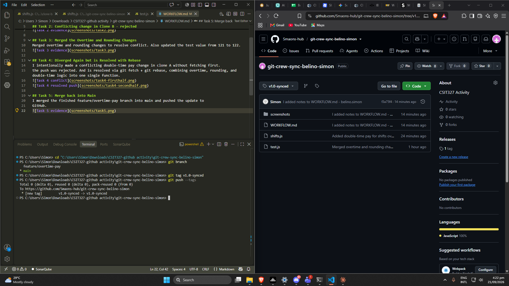

## Task 1: Push from Clone A
Added overtime pay for shifts over 8 hrs

## Task 2: Conflicting change in Clone B - rejected
Rounded shift pay instead of truncating

## Task 3: Merged the Overtime and Rounding Changes
Merged overtime and rounding changes to resolve conflict. Also updated the test value from 121 to 122.

## Task 4: Diverged Again but is Resolved with Rebase
I intentionally made a conflicting double-time pay change in clone A without fetching first.
the push was rejected. And is resolved via git fetch + git rebase, combining overtime, rounding, and double-time logic into one single function.

## Task 5: Merge back into Main
I merged the finished feature/overtime-pay branch into main and pushed the update to
GitHub.

## Task 6: Tag and Finalize
Tagged the final synced commit as v1.0-synced and pushed the tag to GitHub
